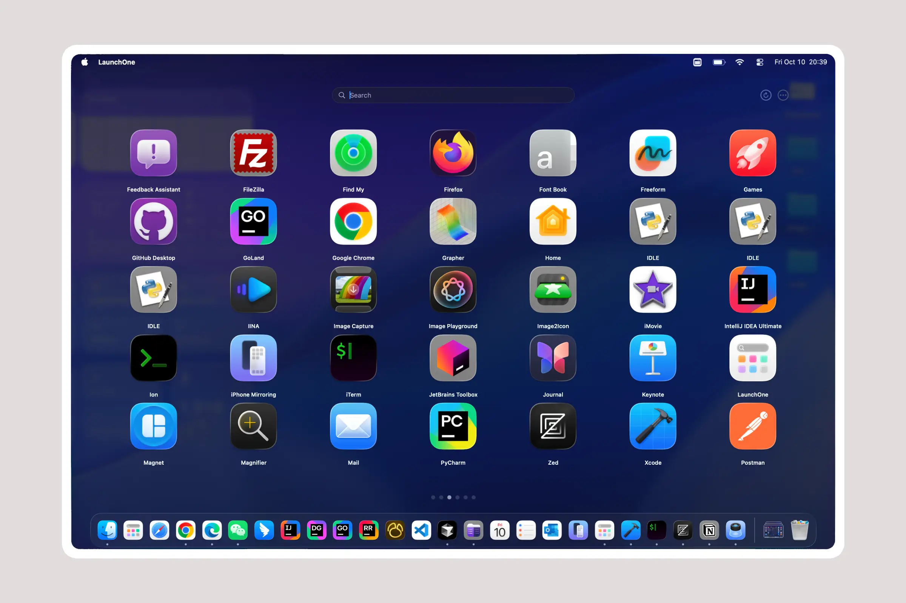
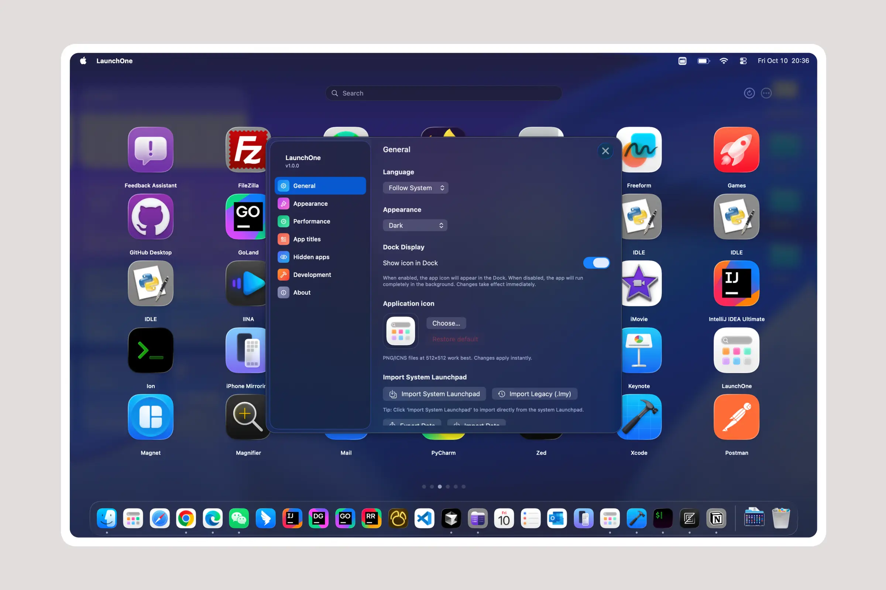
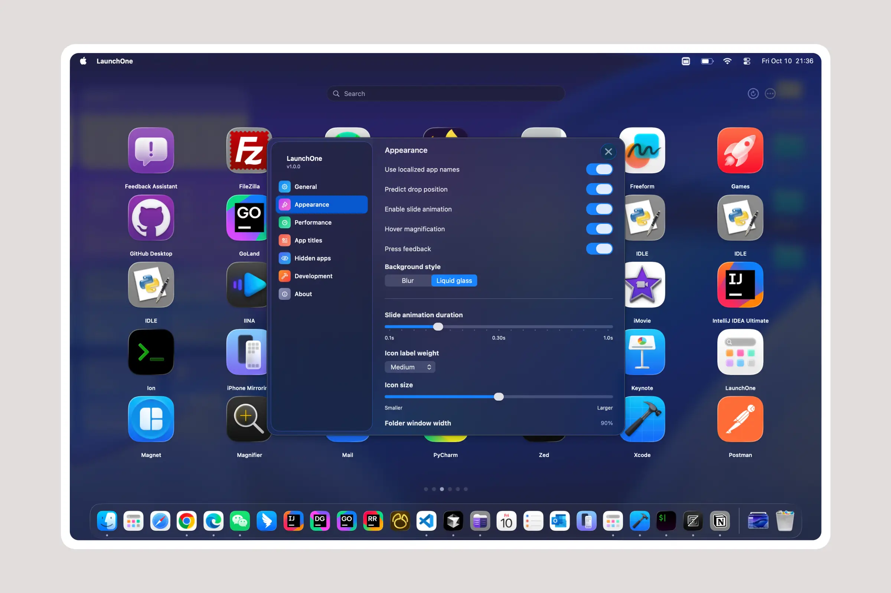
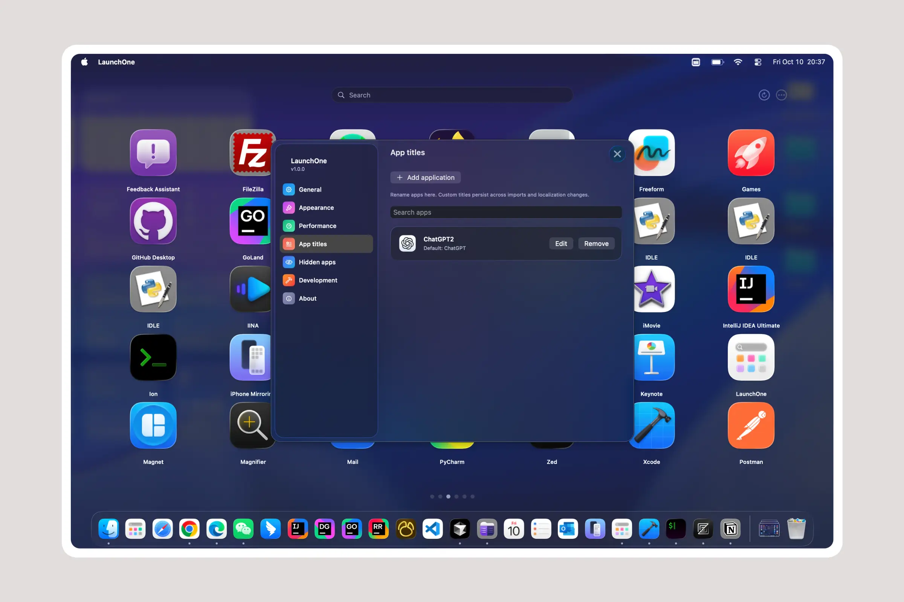

# LaunchOne

**Idiomas**: [English](../../README.md) | [中文](../../README.zh.md) | [日本語](README.ja.md) | [한국어](README.ko.md) | [Français](README.fr.md) | [Español](README.es.md) | [Deutsch](README.de.md) | [Русский](README.ru.md) | [हिन्दी](README.hi.md) | [Tiếng Việt](README.vi.md)

## 📥 Descargar

**[Descargar aquí](https://github.com/mamahuhu-io/LaunchOne/releases/latest)** - Obtén la última versión

⭐ Considera dar una estrella a [LaunchOne](https://github.com/mamahuhu-io/LaunchOne) y especialmente al proyecto original [LaunchNext](https://github.com/RoversX/LaunchNext)!

| | |
|:---:|:---:|
|  |  |
|  |  |

macOS Tahoe eliminó el Launchpad, y la nueva interfaz es difícil de usar y no aprovecha completamente tu Bio GPU. Apple, al menos den a los usuarios la opción de volver atrás. Mientras tanto, aquí está LaunchOne.

*Basado en [LaunchNext](https://github.com/RoversX/LaunchNext) por RoversX - ¡muchas gracias al proyecto original!*

*LaunchNext eligió la licencia GPL 3. LaunchOne sigue los mismos términos de licencia.*

### Lo que ofrece LaunchOne
- ✅ **Importación con un clic desde el Launchpad antiguo del sistema** - lee directamente tu base de datos SQLite de Launchpad nativa (`/private$(getconf DARWIN_USER_DIR)com.apple.dock.launchpad/db/db`) para recrear perfectamente tus carpetas, posiciones de aplicaciones y diseño existentes
- ✅ **Experiencia clásica de Launchpad** - funciona exactamente como la interfaz original
- ✅ **Soporte multilenguaje** - internacionalización completa con inglés, chino, japonés, francés y español
- ✅ **Ocultar etiquetas de íconos** - vista limpia y minimalista cuando no necesitas nombres de aplicaciones
- ✅ **Tamaños de íconos personalizados** - ajusta las dimensiones de los íconos según tus preferencias
- ✅ **Gestión inteligente de carpetas** - crea y organiza carpetas como antes
- ✅ **Búsqueda instantánea y navegación por teclado** - encuentra aplicaciones rápidamente

### Lo que perdimos en macOS Tahoe
- ❌ Sin organización personalizada de aplicaciones
- ❌ Sin carpetas creadas por el usuario
- ❌ Sin personalización de arrastrar y soltar
- ❌ Sin gestión visual de aplicaciones
- ❌ Agrupación por categorías forzada

## Funciones

### 🎯 **Lanzamiento instantáneo de aplicaciones**
- Doble clic para lanzar aplicaciones directamente
- Soporte completo de navegación por teclado
- Búsqueda ultrarrápida con filtrado en tiempo real

### 📁 **Sistema avanzado de carpetas**
- Crea carpetas arrastrando aplicaciones juntas
- Cambia el nombre de las carpetas con edición en línea
- Íconos de carpetas personalizados y organización
- Arrastrar y soltar aplicaciones sin interrupciones

### 🔍 **Búsqueda inteligente**
- Coincidencia difusa en tiempo real
- Buscar en todas las aplicaciones instaladas
- Atajos de teclado de acceso rápido

### 🎨 **Diseño de interfaz moderno**
- **Efecto de vidrio líquido**: regularMaterial con sombras elegantes
- Modos de pantalla completa y en ventana
- Animaciones y transiciones fluidas
- Diseño limpio y receptivo

### 🔄 **Migración de datos perfecta**
- **Importación de Launchpad con un clic** desde la base de datos nativa de macOS
- Descubrimiento y escaneo automático de aplicaciones
- Almacenamiento persistente del diseño mediante SwiftData
- Cero pérdida de datos durante las actualizaciones del sistema

### ⚙️ **Integración del sistema**
- Aplicación nativa de macOS
- Posicionamiento inteligente en múltiples pantallas
- Funciona con el Dock y otras aplicaciones del sistema
- Detección de clics en el fondo (cierre inteligente)

## Arquitectura técnica

### Construido con tecnologías modernas
- **SwiftUI**: Framework UI declarativo y de alto rendimiento
- **SwiftData**: Capa de persistencia de datos robusta
- **AppKit**: Integración profunda con macOS
- **SQLite3**: Lectura directa de la base de datos de Launchpad

### Almacenamiento de datos
Los datos de la aplicación se almacenan de forma segura en:
```
~/Library/Application Support/LaunchOne/Data.store
```

### Integración nativa de Launchpad
Lee directamente de la base de datos del sistema Launchpad:
```bash
/private$(getconf DARWIN_USER_DIR)com.apple.dock.launchpad/db/db
```

## Instalación

### Requisitos del sistema
- macOS 26 (Tahoe) o superior
- Apple Silicon o procesador Intel
- Xcode 26 (para compilar desde el código fuente)

### Compilar desde el código fuente

1. **Clonar el repositorio**
   ```bash
   clone git@github.com:mamahuhu-io/LaunchOne.git
   cd LaunchOne
   ```

2. **Abrir en Xcode**
   ```bash
   open LaunchOne.xcodeproj
   ```

3. **Compilar y ejecutar**
   - Selecciona el dispositivo de destino
   - Presiona `⌘+R` para compilar y ejecutar
   - O `⌘+B` solo para compilar

### Compilación por línea de comandos
```bash
xcodebuild -project LaunchOne.xcodeproj -scheme LaunchOne -configuration Release
```

## Uso

### Inicio rápido
1. **Primer inicio**: LaunchOne escanea automáticamente todas las aplicaciones instaladas
2. **Seleccionar**: Haz clic para seleccionar aplicaciones, doble clic para lanzar
3. **Buscar**: Escribe para filtrar instantáneamente aplicaciones
4. **Organizar**: Arrastra aplicaciones para crear carpetas y diseños personalizados

### Importar tu Launchpad
1. Abre Configuración (icono de engranaje)
2. Haz clic en **"Import Launchpad"**
3. Tu diseño y carpetas existentes se importarán automáticamente

### Gestión de carpetas
- **Crear carpeta**: Arrastra una aplicación sobre otra
- **Renombrar carpeta**: Haz clic en el nombre de la carpeta
- **Agregar aplicaciones**: Arrastra aplicaciones a las carpetas
- **Eliminar aplicaciones**: Arrastra aplicaciones fuera de las carpetas

### Modos de visualización
- **Ventana**: Ventana flotante con esquinas redondeadas
- **Pantalla completa**: Modo de visibilidad máxima
- Cambia el modo en Configuración

## Problemas conocidos

> **Estado de desarrollo actual**
> - 🔄 **Comportamiento de desplazamiento**: Puede ser inestable en algunos escenarios, especialmente con gestos rápidos
> - 🎯 **Creación de carpetas**: La detección para crear carpetas arrastrando y soltando a veces es inconsistente
> - 🛠️ **Desarrollo activo**: Estos problemas se están abordando en próximas versiones

## Solución de problemas

### Problemas comunes

**P: ¿La aplicación no se inicia?**
R: Asegúrate de tener macOS 26+ y verifica los permisos del sistema.

**P: ¿Falta el botón de importar?**
R: Verifica que SettingsView.swift incluya la función de importar.

**P: ¿La búsqueda no funciona?**
R: Intenta volver a escanear las aplicaciones o restablecer los datos de la aplicación en Configuración.

**P: ¿Problemas de rendimiento?**
R: Verifica la configuración de la caché de íconos y reinicia la aplicación.

## ¿Por qué elegir LaunchOne?

### Vs la interfaz "Aplicaciones" de Apple
| Función | Applications (Tahoe) | LaunchOne |
|---------|---------------------|------------|
| Organización personalizada | ❌ | ✅ |
| Carpetas de usuario | ❌ | ✅ |
| Arrastrar y soltar | ❌ | ✅ |
| Gestión visual | ❌ | ✅ |
| Importar datos existentes | ❌ | ✅ |
| Rendimiento | Lento | Rápido |

### Vs otras alternativas a Launchpad
- **Integración nativa**: Lectura directa de la base de datos de Launchpad
- **Arquitectura moderna**: Construido con SwiftUI/SwiftData
- **Cero dependencias**: Swift puro, sin bibliotecas externas
- **Desarrollo activo**: Actualizaciones y mejoras regulares
- **Diseño de vidrio líquido**: Efectos visuales de alta calidad

## Contribución

¡Damos la bienvenida a contribuciones! Por favor:

1. Haz un fork del repositorio
2. Crea una rama de funcionalidad (`git checkout -b feature/amazing-feature`)
3. Realiza commits (`git commit -m 'Add amazing feature'`)
4. Envía los cambios (`git push origin feature/amazing-feature`)
5. Abre un Pull Request

### Guías de desarrollo
- Sigue las convenciones de estilo de Swift
- Agrega comentarios significativos para la lógica compleja
- Prueba en varias versiones de macOS
- Mantén la compatibilidad hacia atrás

## El futuro de la gestión de aplicaciones

A medida que Apple se aleja de interfaces personalizables, LaunchOne representa el compromiso de la comunidad con el control y la personalización del usuario. Creemos que los usuarios deben decidir cómo organizar su espacio de trabajo digital.

**LaunchOne** no es solo un reemplazo de Launchpad: es una declaración de que la elección del usuario importa.


---

**LaunchOne** - Recupera el control de tu lanzador de aplicaciones 🚀

*Construido para usuarios de macOS que no aceptan compromisos en personalización.*

## Herramientas de desarrollo

Este proyecto fue desarrollado con la ayuda de:
- Claude Code - Asistente de desarrollo con IA
- Cursor
- Cursor Cli - Generación y optimización de código